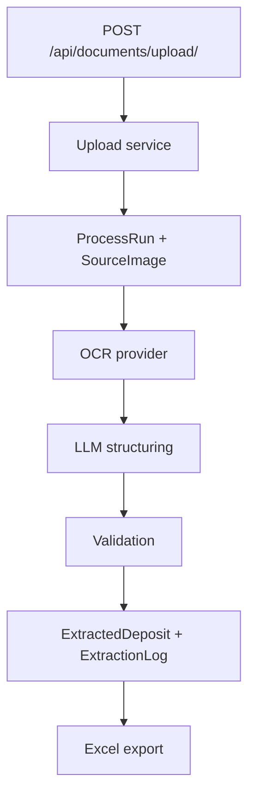

# Flujo de datos

## Flujo principal

1. El upload valida el DOCX.
2. Se extraen imágenes preservando orden.
3. Cada imagen pasa por OCR.
4. La salida se estructura con LLM.
5. Se validan campos y se persisten depósitos.
6. Se registran logs y diagnósticos.
7. El usuario puede corregir y exportar.

