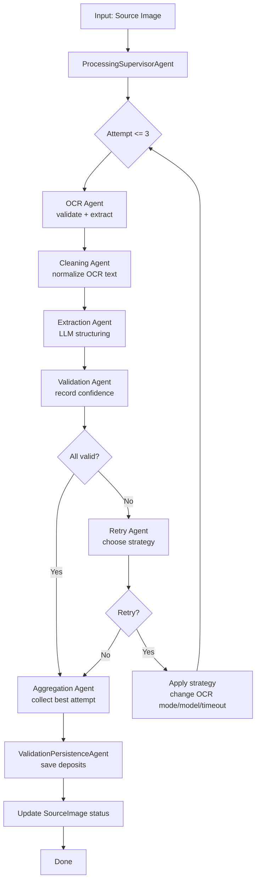

# Multiagent Hybrid Flow

```mermaid
flowchart TD
    A[Input: Source Image] --> B[ProcessingSupervisorAgent]
    B --> C{Attempt <= 3}

    C --> D[OCR Agent\nvalidate + extract]
    D --> E[Cleaning Agent\nnormalize OCR text]
    E --> F[Extraction Agent\nLLM structuring]
    F --> G[Validation Agent\nrecord confidence]

    G --> H{All valid?}
    H -->|Yes| I[Aggregation Agent\ncollect best attempt]
    H -->|No| J[Retry Agent\nchoose strategy]

    J --> K{Retry?}
    K -->|Yes| L[Apply strategy\nchange OCR mode/model/timeout]
    L --> C
    K -->|No| I

    I --> M[ValidationPersistenceAgent\nsave deposits]
    M --> N[Update SourceImage status]
    N --> O[Done]
```
