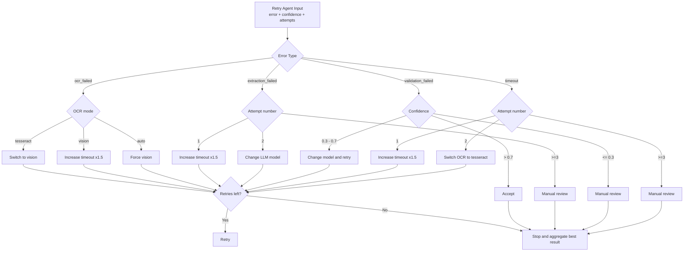

# Retry Decision Tree

```mermaid
flowchart TD
    A[Retry Agent Input\nerror + confidence + attempts] --> B{Error Type}

    B -->|ocr_failed| C{OCR mode}
    C -->|tesseract| C1[Switch to vision]
    C -->|vision| C2[Increase timeout x1.5]
    C -->|auto| C3[Force vision]

    B -->|extraction_failed| D{Attempt number}
    D -->|1| D1[Increase timeout x1.5]
    D -->|2| D2[Change LLM model]
    D -->|>=3| D3[Manual review]

    B -->|validation_failed| E{Confidence}
    E -->|> 0.7| E1[Accept]
    E -->|0.3 - 0.7| E2[Change model and retry]
    E -->|<= 0.3| E3[Manual review]

    B -->|timeout| F{Attempt number}
    F -->|1| F1[Increase timeout x1.5]
    F -->|2| F2[Switch OCR to tesseract]
    F -->|>=3| F3[Manual review]

    C1 --> G{Retries left?}
    C2 --> G
    C3 --> G
    D1 --> G
    D2 --> G
    E2 --> G
    F1 --> G
    F2 --> G

    G -->|Yes| H[Retry]
    G -->|No| I[Stop and aggregate best result]

    E1 --> I
    D3 --> I
    E3 --> I
    F3 --> I
```
